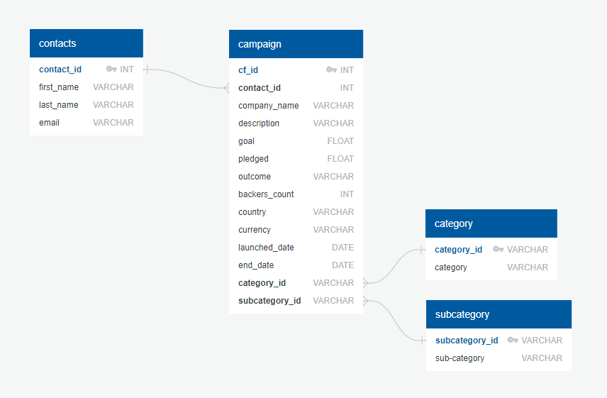

# Project 2

## Website: 
[github](https://github.com/ejtagaca/project-2)

## Description
Learning ETL

## Table of Contents
- [Website](#website)
- [Installation](#installation)
- [Usage](#usage)
- [Credits](#credits)
- [License](#license)
- [Features](#features)
- [Tests](#tests)
- [Contact](#contact)

## Installation
Postgres, Pandas, Python

## Usage
To analyze a company's budget.

## Credits
Edward Tagaca, Lakisha Morris

## License
MIT

## Features
graphs

## Tests
confirm the graphs are created

## Contact
If there are any questions of concerns, I can be reached at:
##### [github: kishgithub24](https://github.com/kishgithub24)
##### [email: lakisha.morris@gmail.com](mailto:lakisha.morris@gmail.com)
